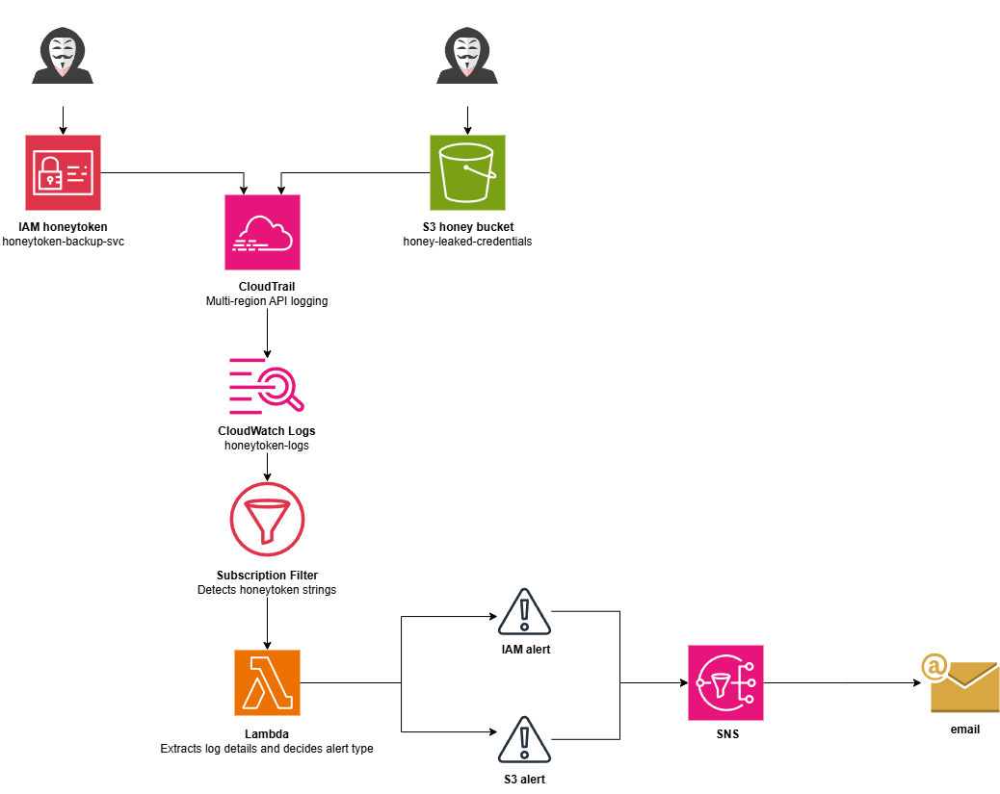

# AWS Honeytoken Detection System 🍯🐝

A serverless AWS intrusion detection system using honeytokens to detect unauthorized access in real time. The system monitors two attack vectors: exposed IAM credentials and S3 honey bucket access.

## What are honeytokens?

Honeytokens are fake credentials or resources deliberately planted in an environment. They have no legitimate use — any interaction with them signals that an attacker has found and is attempting to use them. This project implements two types:

- **IAM honeytoken** — fake AWS credentials that trigger an alert when used by an external attacker who found exposed keys
- **S3 honey bucket** — a fake S3 bucket with convincing credentials that triggers an alert when accessed by an attacker performing reconnaissance inside the AWS account

## Architecture



### Flow

### Components

| Component | Name | Purpose |
|---|---|---|
| IAM User | `honeytoken-backup-svc` | Fake service account with no permissions — the IAM bait |
| S3 Bucket | `honey-leaked-credentials` | Fake bucket with convincing credentials file — the S3 bait |
| S3 Bucket | `honeytoken-cloudtrail-logs` | Dedicated bucket for CloudTrail log storage |
| CloudTrail | `honeytoken-trail` | Multi-region trail that records all API calls in real time |
| CloudWatch Logs | `honeytoken-logs` | Receives CloudTrail events in real time for analysis |
| Subscription Filter | `honeytoken-trigger` | Monitors logs and invokes Lambda when honeytoken strings are detected |
| Lambda | `honeytoken-alert` | Decompresses logs, extracts event details, geolocates the source IP, and sends the alert |
| SNS | `honeytoken-alerts` | Delivers the email alert |

## Detection scenarios

### Scenario 1 — External attacker (IAM honeytoken)
An attacker finds the fake AWS credentials leaked in a GitHub repository or configuration file. When they attempt to use them — even if the action fails with Access Denied — CloudTrail records the attempt. The system detects the `honeytoken-backup-svc` username in the logs and sends an alert within seconds.

### Scenario 2 — Internal attacker (S3 honey bucket)
An attacker who already has some access to the AWS account performs reconnaissance, discovers the `honey-leaked-credentials` bucket, and attempts to download the credentials file. CloudTrail records the S3 Data Event (`GetObject`, `HeadObject`) and the alert fires immediately.

## Alert format

**IAM alert:**
```
🚨 IAM HONEYTOKEN TRIGGERED 🚨

fake IAM credentials were used. an attacker may have found exposed AWS keys.

Event: DescribeInstances
User: honeytoken-backup-svc
Time: 2026-05-16T14:49:00Z
Source IP: 185.220.101.45
Location: Moscow, Russia
User Agent: aws-cli/2.34.48 ... md/command#ec2.describe-instances

investigate immediately and revoke credentials.
```

**S3 alert:**
```
🚨 S3 HONEYTOKEN TRIGGERED 🚨

honey bucket was accessed. an attacker may be performing reconnaissance inside your AWS account.

Event: GetObject
Bucket: honey-leaked-credentials
User: attacker-user
Time: 2026-05-16T15:11:20Z
Source IP: 185.220.101.45
Location: Moscow, Russia
User Agent: aws-cli/2.34.48 ...

investigate immediately.
```

## Cost

**$0/month** — all components run within the AWS free tier:

| Service | Free tier |
|---|---|
| CloudTrail | 1 trail free forever |
| CloudWatch Logs | 5 GB/month free |
| Lambda | 1M invocations/month free |
| SNS | 1,000 emails/month free |
| S3 | 5 GB/month free |

## Prerequisites

- AWS account with CLI configured
- AWS CLI v2
- Python 3.12+

## Setup

> ⚠️ Never commit real credentials to this repository. Use environment variables or AWS Secrets Manager for any sensitive values.

### 1. Create the IAM honeytoken

```bash
aws iam create-user --user-name honeytoken-backup-svc
aws iam create-access-key --user-name honeytoken-backup-svc
```

Store the access key securely — this is the bait. Do not attach any policies.

### 2. Create the S3 honey bucket

```bash
aws s3 mb s3://honey-leaked-credentials --region eu-west-1
echo '{"db_password": "prod-db-pass-2024", "api_key": "sk-fake-key"}' > credentials.json
aws s3 cp credentials.json s3://honey-leaked-credentials/credentials.json
```

### 3. Create the CloudTrail log bucket

```bash
aws s3 mb s3://honeytoken-cloudtrail-logs --region eu-west-1
aws s3api put-bucket-policy --bucket honeytoken-cloudtrail-logs --policy file://setup/bucket-policy.json
```

### 4. Create and start CloudTrail

```bash
aws cloudtrail create-trail --name honeytoken-trail --s3-bucket-name honeytoken-cloudtrail-logs --region eu-west-1
aws cloudtrail update-trail --name honeytoken-trail --is-multi-region-trail --region eu-west-1
aws cloudtrail start-logging --name honeytoken-trail --region eu-west-1

aws cloudtrail put-event-selectors --trail-name honeytoken-trail \
  --event-selectors '[{"ReadWriteType":"All","IncludeManagementEvents":true,"DataResources":[{"Type":"AWS::S3::Object","Values":["arn:aws:s3:::honey-leaked-credentials/"]}]}]' \
  --region eu-west-1
```

### 5. Configure CloudWatch Logs

```bash
aws iam create-role --role-name cloudtrail-cloudwatch-role --assume-role-policy-document file://setup/cloudtrail-trust-policy.json
aws iam put-role-policy --role-name cloudtrail-cloudwatch-role --policy-name cloudtrail-cloudwatch-policy --policy-document file://setup/cloudtrail-cloudwatch-policy.json
aws logs create-log-group --log-group-name honeytoken-logs --region eu-west-1
aws cloudtrail update-trail --name honeytoken-trail \
  --cloud-watch-logs-log-group-arn arn:aws:logs:eu-west-1:YOUR_ACCOUNT_ID:log-group:honeytoken-logs:* \
  --cloud-watch-logs-role-arn arn:aws:iam::YOUR_ACCOUNT_ID:role/cloudtrail-cloudwatch-role \
  --region eu-west-1
```

### 6. Create SNS topic and subscribe

```bash
aws sns create-topic --name honeytoken-alerts --region eu-west-1
aws sns subscribe --topic-arn arn:aws:sns:eu-west-1:YOUR_ACCOUNT_ID:honeytoken-alerts \
  --protocol email --notification-endpoint YOUR_EMAIL --region eu-west-1
```

Confirm the subscription via email.

### 7. Deploy Lambda

```bash
aws iam create-role --role-name honeytoken-lambda-role --assume-role-policy-document file://setup/lambda-trust-policy.json
aws iam attach-role-policy --role-name honeytoken-lambda-role --policy-arn arn:aws:iam::aws:policy/service-role/AWSLambdaBasicExecutionRole
aws iam attach-role-policy --role-name honeytoken-lambda-role --policy-arn arn:aws:iam::aws:policy/AmazonSNSFullAccess

zip lambda_function.zip lambda_function.py
aws lambda create-function --function-name honeytoken-alert \
  --runtime python3.12 \
  --role arn:aws:iam::YOUR_ACCOUNT_ID:role/honeytoken-lambda-role \
  --handler lambda_function.lambda_handler \
  --zip-file fileb://lambda_function.zip \
  --environment Variables={SNS_TOPIC_ARN=arn:aws:sns:eu-west-1:YOUR_ACCOUNT_ID:honeytoken-alerts} \
  --region eu-west-1
```

### 8. Create Subscription Filter

```bash
aws lambda add-permission --function-name honeytoken-alert \
  --statement-id cloudwatch-logs-invoke \
  --action lambda:InvokeFunction \
  --principal logs.eu-west-1.amazonaws.com \
  --source-account YOUR_ACCOUNT_ID \
  --region eu-west-1

aws logs put-subscription-filter \
  --log-group-name honeytoken-logs \
  --filter-name honeytoken-trigger \
  --filter-pattern '?"honeytoken-backup-svc" ?"honey-leaked-credentials"' \
  --destination-arn arn:aws:lambda:eu-west-1:YOUR_ACCOUNT_ID:function:honeytoken-alert \
  --region eu-west-1
```

## Testing

**Test IAM honeytoken:**
```bash
AWS_ACCESS_KEY_ID=YOUR_HONEYTOKEN_KEY AWS_SECRET_ACCESS_KEY=YOUR_HONEYTOKEN_SECRET \
  aws ec2 describe-instances --region eu-west-1
```

**Test S3 honey bucket:**
```bash
aws s3 cp s3://honey-leaked-credentials/credentials.json /tmp/test.json
```

An alert email should arrive within 60 seconds.

## Security considerations

- The IAM honeytoken has zero attached policies — any successful API call using these credentials is flagged
- The S3 honey bucket has no legitimate use — any access is suspicious
- No sensitive information is hardcoded — all ARNs and account IDs use environment variables or placeholders
- CloudTrail logs are stored in a dedicated bucket separate from the honey bucket