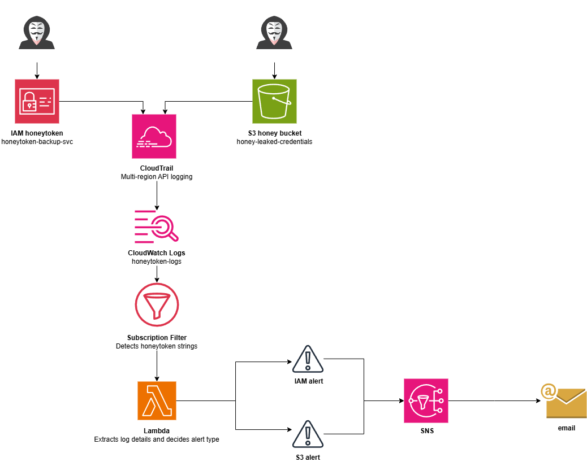

# honeytoken-detector 🍯

Fake AWS credentials that email you the moment someone tries to use them.

There are two traps here. The first is an IAM user with no permissions attached, whose access keys you deliberately leave somewhere an attacker would look. The second is an S3 bucket stuffed with convincing-looking secrets that nothing in your infrastructure ever reads.

Neither has any legitimate reason to be touched. So if either one gets touched, you have a problem, and you know about it in under a minute.

## Why this approach

Most detection work is about finding a signal buried in normal traffic, which means baselines, thresholds, and a lot of tuning to keep the false positives down. Honeytokens skip all of that. Nobody on your team has a reason to call `GetObject` on a bucket that appears in no runbook and no deploy script. There's nothing to tune because there's no legitimate traffic to distinguish from.

The tradeoff is coverage. This catches an attacker who takes the bait, and nothing else. It's a tripwire, not a security program.

## Architecture



CloudTrail records the API call and ships it to CloudWatch Logs. A subscription filter watches that log group for the honeytoken names and invokes a Lambda when it sees one. The Lambda unzips the event, pulls out who did what from where, looks up the IP, and publishes to SNS. SNS sends the email.

End to end it's usually 40 to 90 seconds, most of which is CloudTrail's delivery lag.

### Components

| Component | Name | Purpose |
|---|---|---|
| IAM User | `honeytoken-backup-svc` | Fake service account, zero permissions. The IAM bait. |
| S3 Bucket | `honey-leaked-credentials` | Fake bucket with a plausible credentials file. The S3 bait. |
| S3 Bucket | `honeytoken-cloudtrail-logs` | Where CloudTrail writes its logs |
| CloudTrail | `honeytoken-trail` | Multi-region trail recording API calls |
| CloudWatch Logs | `honeytoken-logs` | Receives the trail events |
| Subscription Filter | `honeytoken-trigger` | Matches the honeytoken strings, invokes Lambda |
| Lambda | `honeytoken-alert` | Parses the event, geolocates the IP, sends the alert |
| SNS | `honeytoken-alerts` | Delivers the email |

## What it catches

**Someone found your leaked keys.** You've planted the `honeytoken-backup-svc` access key in a public repo, an old config file, a paste site, wherever. An attacker finds it and runs something to see what it can do. The call fails with Access Denied because the user has no policies. Doesn't matter: CloudTrail logs the attempt anyway, which is the entire point. Alert fires.

**Someone's already inside and looking around.** An attacker with some level of access enumerates your buckets, spots one called `honey-leaked-credentials`, and pulls the credentials file. The S3 data event gets logged and the alert fires. This one tells you something worse than the first: they didn't need to find keys, they already had access.

## Alert format

IAM:

```
🚨 IAM HONEYTOKEN TRIGGERED 🚨

fake IAM credentials were used. an attacker may have found exposed AWS keys.

Event: DescribeInstances
User: honeytoken-backup-svc
Time: 2026-05-16T14:49:00Z
Source IP: 185.220.101.45
Location: Moscow, Russia
User Agent: aws-cli/2.34.48 ... md/command#ec2.describe-instances

investigate immediately and revoke credentials.
```

S3:

```
🚨 S3 HONEYTOKEN TRIGGERED 🚨

honey bucket was accessed. an attacker may be performing reconnaissance inside your AWS account.

Event: GetObject
Bucket: honey-leaked-credentials
User: attacker-user
Time: 2026-05-16T15:11:20Z
Source IP: 185.220.101.45
Location: Moscow, Russia
User Agent: aws-cli/2.34.48 ...

investigate immediately.
```

## Cost

Close to free, but not exactly free.

CloudTrail gives you one trail's management events at no charge, CloudWatch Logs covers 5 GB of ingestion a month, Lambda covers a million invocations, SNS covers a thousand emails, and S3 covers 5 GB. All of that is comfortably within the free tier for this workload.

The exception is S3 data events, which aren't part of the CloudTrail free tier. They run about $0.10 per 100,000 events. Since the honey bucket should see zero traffic, this rounds to nothing in practice. Just don't point the event selector at a bucket that's actually in use, or you'll be paying for every object read in it.

## Prerequisites

- AWS account with CLI configured
- AWS CLI v2
- Python 3.12+

## Setup

Replace `YOUR_ACCOUNT_ID`, `YOUR_EMAIL`, and the region as you go. Everything below assumes `eu-west-1`.

### 1. IAM honeytoken

```bash
aws iam create-user --user-name honeytoken-backup-svc
aws iam create-access-key --user-name honeytoken-backup-svc
```

Save the access key somewhere you can get at it later. That's the bait. Don't attach any policies to this user, ever.

### 2. S3 honey bucket

```bash
aws s3 mb s3://honey-leaked-credentials --region eu-west-1
echo '{"db_password": "prod-db-pass-2024", "api_key": "sk-fake-key"}' > credentials.json
aws s3 cp credentials.json s3://honey-leaked-credentials/credentials.json
```

### 3. CloudTrail log bucket

```bash
aws s3 mb s3://honeytoken-cloudtrail-logs --region eu-west-1
aws s3api put-bucket-policy --bucket honeytoken-cloudtrail-logs --policy file://setup/bucket-policy.json
```

### 4. Create and start the trail

```bash
aws cloudtrail create-trail --name honeytoken-trail --s3-bucket-name honeytoken-cloudtrail-logs --region eu-west-1
aws cloudtrail update-trail --name honeytoken-trail --is-multi-region-trail --region eu-west-1
aws cloudtrail start-logging --name honeytoken-trail --region eu-west-1

aws cloudtrail put-event-selectors --trail-name honeytoken-trail \
  --event-selectors '[{"ReadWriteType":"All","IncludeManagementEvents":true,"DataResources":[{"Type":"AWS::S3::Object","Values":["arn:aws:s3:::honey-leaked-credentials/"]}]}]' \
  --region eu-west-1
```

The event selector is what makes the S3 half work. Without it you get management events only, and `GetObject` never shows up in the logs.

### 5. Wire CloudTrail to CloudWatch Logs

```bash
aws iam create-role --role-name cloudtrail-cloudwatch-role --assume-role-policy-document file://setup/cloudtrail-trust-policy.json
aws iam put-role-policy --role-name cloudtrail-cloudwatch-role --policy-name cloudtrail-cloudwatch-policy --policy-document file://setup/cloudtrail-cloudwatch-policy.json
aws logs create-log-group --log-group-name honeytoken-logs --region eu-west-1

aws cloudtrail update-trail --name honeytoken-trail \
  --cloud-watch-logs-log-group-arn arn:aws:logs:eu-west-1:YOUR_ACCOUNT_ID:log-group:honeytoken-logs:* \
  --cloud-watch-logs-role-arn arn:aws:iam::YOUR_ACCOUNT_ID:role/cloudtrail-cloudwatch-role \
  --region eu-west-1
```

### 6. SNS topic

```bash
aws sns create-topic --name honeytoken-alerts --region eu-west-1
aws sns subscribe --topic-arn arn:aws:sns:eu-west-1:YOUR_ACCOUNT_ID:honeytoken-alerts \
  --protocol email --notification-endpoint YOUR_EMAIL --region eu-west-1
```

Go confirm the subscription in your inbox before moving on. An unconfirmed subscription fails silently later and it's annoying to debug.

### 7. Lambda

```bash
aws iam create-role --role-name honeytoken-lambda-role --assume-role-policy-document file://setup/lambda-trust-policy.json
aws iam attach-role-policy --role-name honeytoken-lambda-role --policy-arn arn:aws:iam::aws:policy/service-role/AWSLambdaBasicExecutionRole
aws iam attach-role-policy --role-name honeytoken-lambda-role --policy-arn arn:aws:iam::aws:policy/AmazonSNSFullAccess

zip lambda_function.zip lambda_function.py
aws lambda create-function --function-name honeytoken-alert \
  --runtime python3.12 \
  --role arn:aws:iam::YOUR_ACCOUNT_ID:role/honeytoken-lambda-role \
  --handler lambda_function.lambda_handler \
  --zip-file fileb://lambda_function.zip \
  --environment Variables={SNS_TOPIC_ARN=arn:aws:sns:eu-west-1:YOUR_ACCOUNT_ID:honeytoken-alerts} \
  --region eu-west-1
```

`AmazonSNSFullAccess` is broader than this needs. If you care, swap it for an inline policy allowing `sns:Publish` on just the one topic ARN.

### 8. Subscription filter

```bash
aws lambda add-permission --function-name honeytoken-alert \
  --statement-id cloudwatch-logs-invoke \
  --action lambda:InvokeFunction \
  --principal logs.eu-west-1.amazonaws.com \
  --source-account YOUR_ACCOUNT_ID \
  --region eu-west-1

aws logs put-subscription-filter \
  --log-group-name honeytoken-logs \
  --filter-name honeytoken-trigger \
  --filter-pattern '?"honeytoken-backup-svc" ?"honey-leaked-credentials"' \
  --destination-arn arn:aws:lambda:eu-west-1:YOUR_ACCOUNT_ID:function:honeytoken-alert \
  --region eu-west-1
```

The `add-permission` call has to come first. Skip it and the filter creation fails with an error that doesn't mention permissions at all.

## Testing

IAM side:

```bash
AWS_ACCESS_KEY_ID=YOUR_HONEYTOKEN_KEY AWS_SECRET_ACCESS_KEY=YOUR_HONEYTOKEN_SECRET \
  aws ec2 describe-instances --region eu-west-1
```

S3 side:

```bash
aws s3 cp s3://honey-leaked-credentials/credentials.json /tmp/test.json
```

Give it a minute. If nothing arrives, check the Lambda's CloudWatch logs first. That tells you whether the filter matched, which narrows the problem down to one half of the pipeline or the other.

## Gotchas

A few things that cost me time:

- **CloudTrail delivery isn't instant.** It's typically 30 to 90 seconds from API call to CloudWatch Logs, sometimes longer. If you test and nothing shows up in ten seconds, wait before you start tearing things apart.
- **Failed calls still get logged.** People assume Access Denied means nothing was recorded. It's the opposite. The denied attempt is exactly the signal you want.
- **The filter pattern's quoting is fragile.** `?"a" ?"b"` is an OR. Your shell will happily mangle those quotes if you paste it into the wrong context.
- **The CloudTrail bucket policy needs the right `SourceArn` condition**, or `create-trail` rejects the bucket with a vague message. See `setup/bucket-policy.json`.
- **Geolocation is best-effort.** The free IP lookup tier is rate-limited, so a burst of events can leave you with alerts that have no location field. The alert should still send; don't let the lookup throw.

## Notes on running this for real

This repo uses deliberately obvious names like `honeytoken-backup-svc` and `honey-leaked-credentials`, because it's easier to read that way. That's exactly wrong for production. A honeytoken only works if the attacker doesn't recognize it as one, so pick names that look like they belong: `backup-service-prod`, `legacy-deploy-svc`, `db-migration-user`. If you rename things, update the filter pattern to match.

Same logic applies to placement. Keys sitting in a repo called `honeypot` aren't going to fool anyone. Put them where real credentials would plausibly leak: a stale `.env` in an old branch, a config file in a forgotten Docker image, a Terraform state file that got committed once.

The IAM user having zero policies is a design decision worth keeping. It means any successful API call with those keys is impossible by construction, so there's no scenario where a real workflow accidentally trips the alarm.
